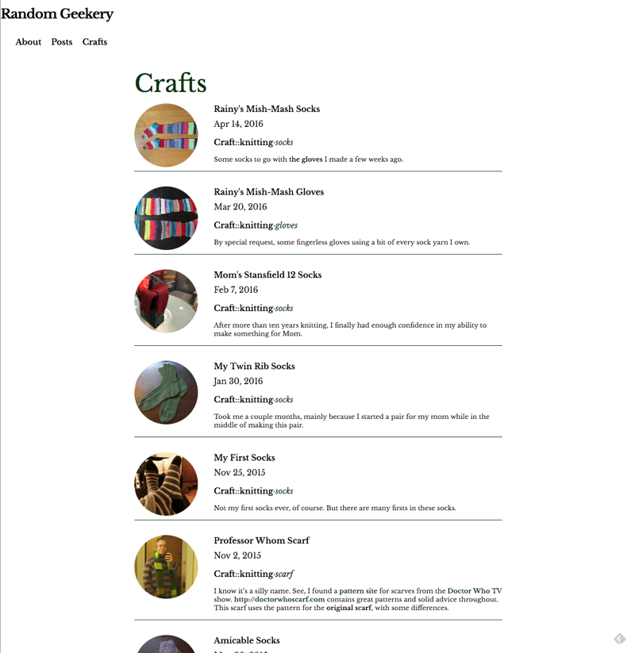
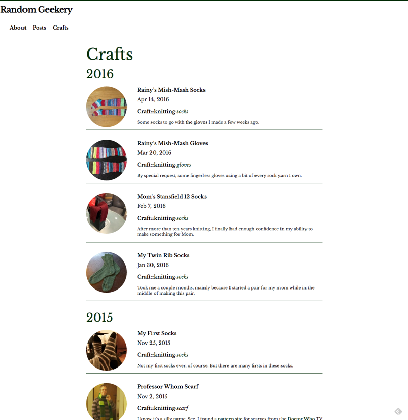
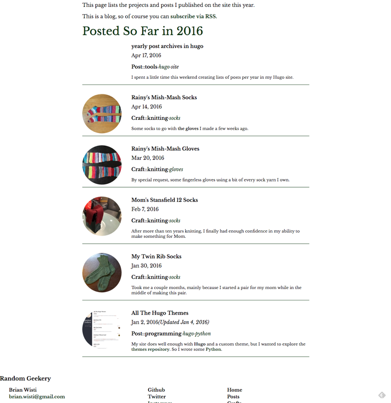
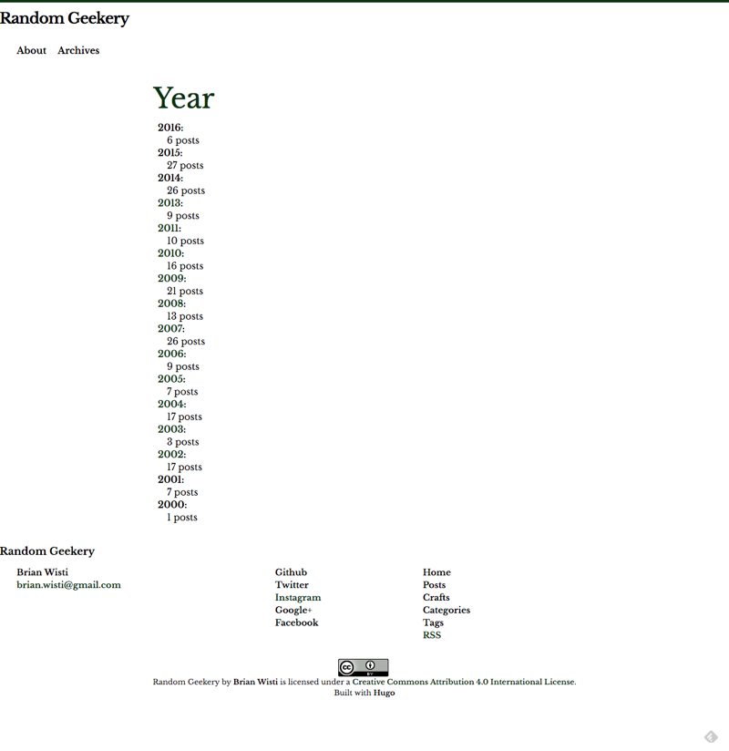
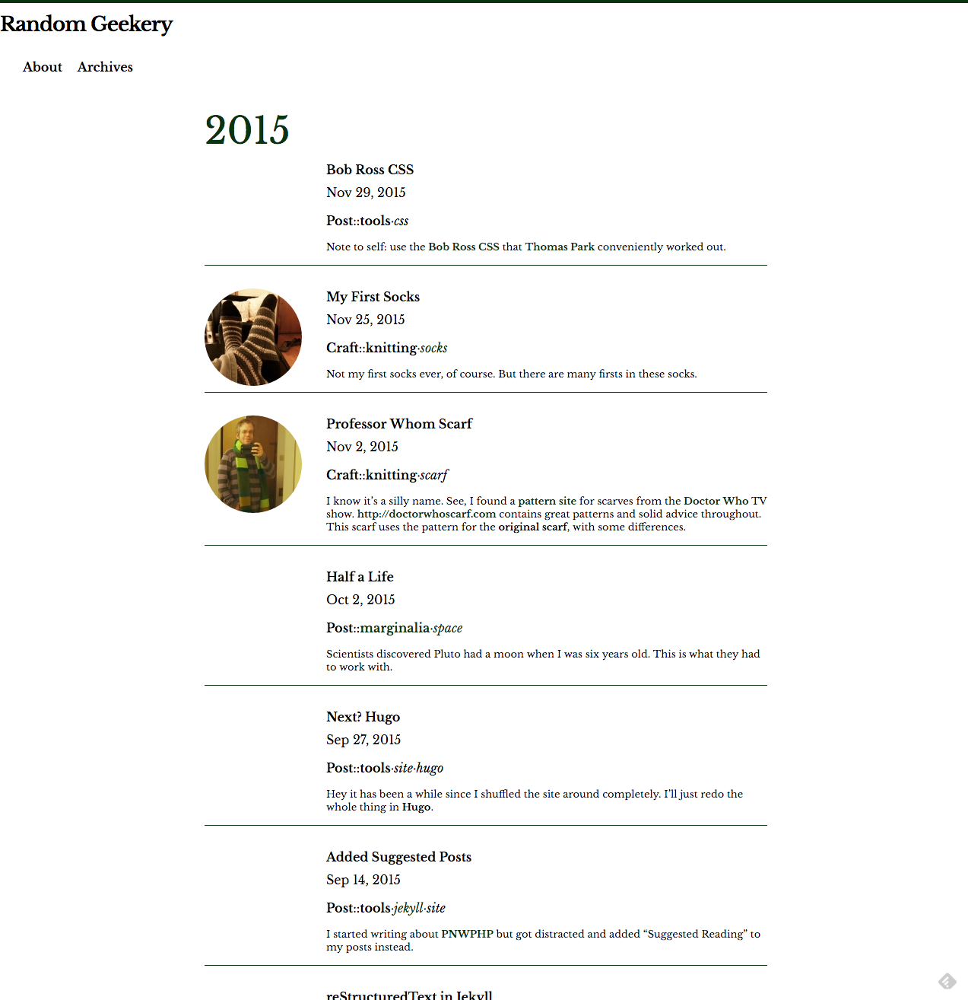

---
aliases:
- /post/2016/yearly-post-archives-in-hugo/
- /2016/04/17/yearly-post-archives-in-hugo/
category: tools
date: 2016-04-17 15:11:16
slug: yearly-post-archives-in-hugo
tags:
- hugo
- site
- perl
title: Yearly Post Archives In Hugo
uuid: dfe162da-91d0-4d62-9267-dea5154a8bb4
---

I spent a little time this weekend creating [yearly post archives](/archive/) for my [Hugo](https://gohugo.io/) site.

Hugo already has [pagination](https://gohugo.io/extras/pagination/) functionality, but I dislike this approach in blogs.
For one thing, it messes up web search.
I find an interesting link which Google claims is on page 12 of some blog, but now I must dig to page 14 or 15 or 23.

Years give me a fixed point to anchor my archive listings to.
I could narrow it down to years and months, but I am not that prolific.
Years will do fine.

## Everything On One Page For Each Section

Hugo bases [template selection](https://gohugo.io/templates/list/) on specificity:
use the most specific template if available, otherwise use more general-purpose templates.
Right now I lean on my `_default` layouts for all content.
The `_default/list.ace` template provides the layout for all content collections.

``` handlebars
= content main
  h1 {{ .Title }}
  ul.post-list
    {{ range .Data.Pages }}
      li {{ .Render "li" }}
    {{ end }}
```

<aside class="admonition note">
<p class="admonition-title">Note</p>

I use [Hugo’s support for Ace templates](https://gohugo.io/templates/ace) on my site.
The important stuff is in the `{{ …​ }}` blocks, so try not to get too distracted by Ace.

</aside>

Hugo gives the template a title and a collection of pages —
along with numerous other [variables](https://gohugo.io/templates/variables/),
and at the other end something like this is produced.



## Group Everything By Date

For a first step in the process, let’s see what happens when we tell the Pages to [group by date](https://gohugo.io/templates/list/#grouping-by-page-date).

``` handlebars
= content main
  h1 {{ .Title }}
  {{ range (.Data.Pages.GroupByDate "2006") }}
    h2 {{ .Key }}
    ul.post-list
      {{ range .Pages }}
        li {{ .Render "li" }}
      {{ end }}
  {{ end }}
```



Not too bad. Let’s move on.

## This Year’s Content

[`first`]: https://gohugo.io/templates/functions/#first

Hold on a second.
I can use the [`first`][] function to create a list of things published this year.
I’ll put that in my `index.ace` layout.

``` handlebars
= content main
  p This page lists the projects and posts I published on the site this year.
  p This is a blog, so of course you can
    a href="/index.xml"  subscribe via RSS.
  {{ range first 1 (.Data.Pages.GroupByDate "2006") }}
    h2 Posted So Far in {{ .Key }}
    ul.post-list
      {{ range .Pages }}
        li {{ .Render "li" }}
      {{ end }}
  {{ end }}
```



No matter how hard I tried, I could not find a way to create a page for *last year* with this technique.
Moving on.

## Life Hack: Use Taxonomies!

[Hugo community comment]: https://discuss.gohugo.io/t/pagination-and-group-by-date/1441/3
[taxonomies]: http://gohugo.io/taxonomies/overview/

Hugo does not directly support yearly archive pages.
However, this [Hugo community comment][] shows that somebody solved a very similar problem using [taxonomies][].

Taxonomies are special terms you create to organize your content.
[Categories](/categories/) and [tags](/tags/) are a common example across blogs.
Hugo simplifies creation of your own taxonomies and their presentation with templates.

Strictly speaking, this is kind of a hack.
You would ordinarily put an entry with singular and plural names for your taxonomies in `config.yml`,
but I do not care about pluralization in this case.
I just want a way to create "year" templates.

``` yaml
taxonomies:
    year: "year"
```

In order for this to work, I need every content item to have a `year` entry in its front matter set to the year that item was published.

``` yaml
year: 2016
```

This is going to be tedious.
Let’s not do this manually, okay?

Here comes the [Perl](/tags/perl/).

### Automate The Frontmatter

``` perl
#!/usr/bin/env perl

use v5.22.0;
use autodie qw(:all);

use File::Find::Rule;
use File::Slurper qw(read_text write_text);
use YAML::Tiny;

sub add_metadata_to {
  my $filename = shift;
  say "Looking at $filename";

  my $original = read_text $filename;
  my ( $empty, $front_matter, $content ) = split /^---$/m, $original;
  my $yaml = YAML::Tiny->read_string( $front_matter );
  my $date = $yaml->[0]{date};

  if ( $date =~ m{^ (?<year> \d\d\d\d) - (?<month> \d\d) - }x ) {
    $yaml->[0]{year} = $+{year};
  }
  else {
    # Avoid converting simple pages.
    return;
  }

  my $new_front_matter = $yaml->write_string;
  my $new_content = $new_front_matter . "---" . $content;
  write_text $filename, $new_content;
  say "Updated $filename metadata";
}

my @files = File::Find::Rule->file()
  ->name( qw( *.md *.html ) )
  ->in( "content" );

add_metadata_to $_ for @files;
```

## Summarize Every Year On One Page

My `_default/terms.ace` layout was already set up for categories and
tags. The reverse alphabetical order was some whimsical experiment that
I forgot to change, but it works perfect for years. Reverse alphabetical
looks quite a bit like reverse chronological when things are sorted in
[ASCIIbetical](https://en.wiktionary.org/wiki/ASCIIbetical) order.

``` handlebars
= content main
  h1 {{ .Title }}
  dl
    {{ $data := .Data }}
    {{ range $key, $value := .Data.Terms.Alphabetical.Reverse }}
      dt
        a href="/{{ $data.Plural }}/{{ $value.Name | urlize }}" {{ $value.Name }}
      dd {{ $value.Count }} posts
    {{ end }}
```

So by adding one little entry to `config.yml` and making one little edit —
okay, write a Perl script to make one little edit to every page in my site —
I get a usable yearly archive!



I put `_default/list.ace` back in its original state, and each year has a simple listing.



## What Else?

It would sure be nice to have "next year" / "previous year" links.
I can use GroupBy functionality to create distinct craft and blog sections for each year’s listing.
For that matter, I could see breaking Crafts and Posts listings down into yearly archives.

You know what?
This is good enough for now.
I set out to have yearly archive pages.
I have yearly archive pages.
Time to go out and enjoy an unexpectedly pleasant Seattle Sunday.