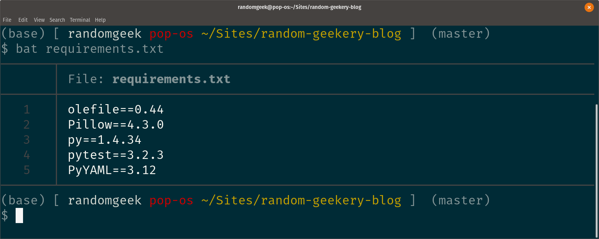

---
aliases:
- /2019/05/24/pretty-print-terminal-files-with-bat/
category: Tools
cover_image: cover.png
date: 2019-05-24 00:00:00
description: '[bat](https://github.com/sharkdp/bat) is like a fancier `cat` for displaying
  file contents.

  '
slug: pretty-print-terminal-files-with-bat
tags:
- shell
title: Pretty Print Terminal Files With Bat
uuid: 58d986bb-ef26-4669-b1f3-769c0be12ec6
---

My work routine lately includes automatic generation of SQL files for
database updates. That routine includes quickly skimming them to find
obvious errors. I wanted something quicker than reviewing them in my
editor, but fancier than the simple plain text of cat.

I have the [Pygments](http://pygments.org/) syntax highlighting library
for [Python](/tags/python) installed, so I could use `pygmentize` piped
to `less` for paging:

    $ pygmentize -g work.sql | less -NR

However, that is noticeably slow and most definitely not convenient.
Adding an alias helped the convenience, but did nothing for the
sluggishness.

[bat](https://github.com/sharkdp/bat) provides what I need. It runs
quick enough that I don’t need to think about it, highlights code,
numbers lines, indicates git changes in the margin, and feeds the result
to `less` if there’s more than you can display on one screen.

Packages are available for several Linux distributions, or you can
install it via [Homebrew](https://brew.sh/) (reminder: Homebrew works on
macOS *and* Linux these days).

    $ brew install bat

<aside class="admonition">

Oh hey there’s something about the [Nix](https://nixos.org/nix/) package
manager on the `bat` README. Adding a [Taskwarrior](/tags/taskwarrior)
item to check that out later.

</aside>

Sometimes I need to check the structure of files where whitespace
matters: tab-delimited files, Makefiles, Python, stuff like that. `bat
-A` shows whitespace and other non-printable characters displayed,
though you lose syntax highlighting.

## Plain Text

I enjoy the formatting conveniences from `bat` even when examining plain
text files.

This is all I’ve needed `bat` for, but it’s flexible enough to work into
your everyday shell just like `cat`. Check out the
[README](https://github.com/sharkdp/bat) for ideas.